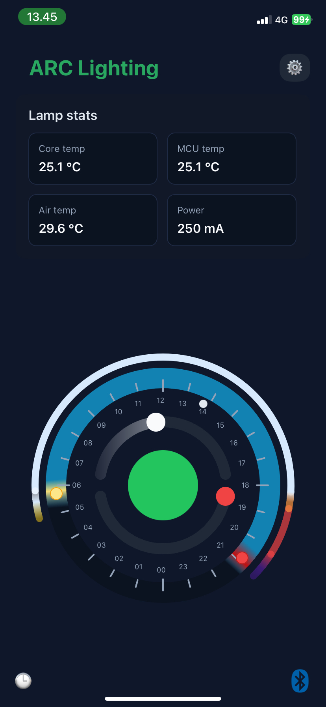

# ARC-Devs

ARC-Devs samler offentlig udviklingsstatus for ARC-modulerne og KlimaLab AI Accelereret.

Formålet er at gøre fremdriften synlig: hardwarestatus, bring-up, firmwaremilepæle, testnoter og udvalgte måledata kan samles her eller linkes herfra til de aktive udviklingsrepos.

## Aktuel status

- ARC-Probe PCB-designet bestilt. Printpladerne produceres med ENIG-overfladefinish og forventes afsendt fra Tyskland den 19. maj 2026.
- ST-udviklingsværktøj med STM32WBA5 Bluetooth-modulet er til rådighed, så firmwaretest kan påbegyndes parallelt med PCB-produktionen.
- Komponenter til første ARC-Probe bring-up, bestilt hos Mouser 29. april 2026, er modtaget.
- Første FreeRTOS heartbeat er verificeret på STM32WBA5 platformen.
- iOS Mesh bring-up er i gang: MESH-provisionering virker i den aktuelle testopsætning, og den tilpassede ARC Lighting homescreen viser live lampestatus, solopgang/solnedgang samt indstillinger for lampens on/off-tider og fade-forløb.
- Når printpladerne modtages, starter ARC-Probe bring-up med montage, strømtest, sensorvalidering, firmwareintegration og første måledata.

 

	

 

Note: Skærmbilledet viser et work in progress-design. Knappen i midten er tænd/sluk, og de buede sliders bruges til lysintensitet og relaterede lampeindstillinger. All rights reserved.

## Bring-Up Logs

- [ARC-Probe bring-up log](arc-probe-bringup-log.md)

- [iOS bring-up log](ios-iphone-bringup-log.md)

## Arbejdsprincip

Udviklingen dokumenteres løbende, så pilotarbejdet kan følges fra tidlige hardware- og firmwaretests til første måledata.
